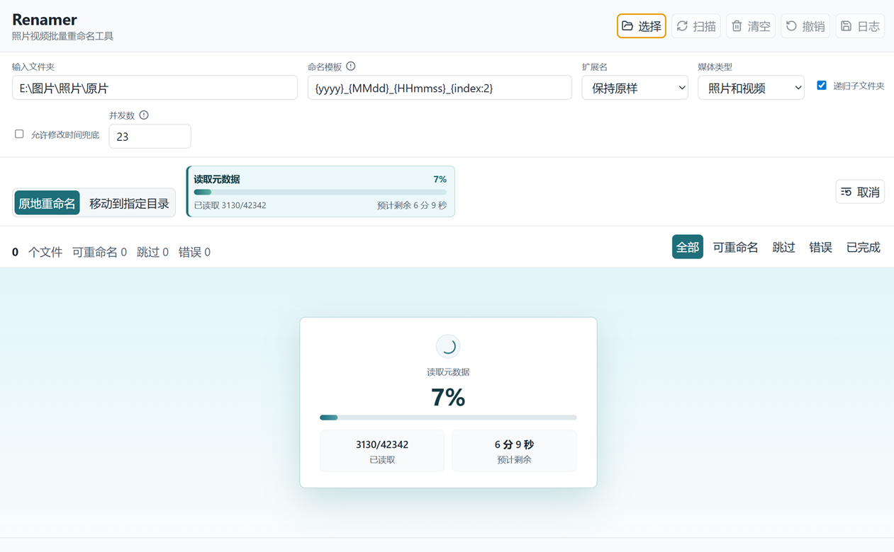

# Renamer


<p align="center">
  <a href="#快速开始"></a>
  <a href="#技术栈"></a>
  <a href="#技术栈"></a>
  <a href="#测试"></a>
  
</p>
<p align="center">
  <strong>面向 Windows 的照片与视频批量重命名桌面工具。</strong>
</p>

Renamer 是一个用于整理照片和视频文件名的 Windows 桌面应用。它会扫描指定文件夹，读取媒体拍摄时间，生成可预览的新文件名，稳定处理重名冲突，并在确认后执行原地重命名或移动到指定目录。

默认命名格式：

```text
YYYY_MMDD_HHmmss_SSS_NN.ext
```

示例：

```text
IMG_0001.JPG -> 2026_0517_193025_128_00.JPG
IMG_0002.JPG -> 2026_0517_193025_128_01.JPG
VID_0003.MP4 -> 2026_0517_193026_000_00.MP4
```

<p align="center">
  
</p>

## 功能亮点

- 支持照片与视频文件批量重命名。
- 优先读取 EXIF、视频容器等元数据中的拍摄时间。
- 支持文件创建时间、修改时间等兜底时间来源。
- 执行前展示完整预览：原文件名、新文件名、媒体类型、时间来源、状态与提示。
- 支持自定义命名模板，例如 `{yyyy}`、`{MMdd}`、`{HHmmss}`、`{SSS}`、`{index}`、`{original}`。
- 自动用从 `00` 开始的序号稳定解决同名冲突。
- 支持扩展名保持原样、统一小写或统一大写。
- 支持递归扫描子文件夹，并可按照片、视频类型过滤。
- 支持原地重命名，也支持重命名后移动到指定输出目录。
- 每次执行生成操作日志，并支持撤销上一次成功的重命名任务。
- 采用安全的 Electron 架构：渲染进程负责界面，主进程负责文件系统操作。

## 快速开始

环境要求：

- Windows 10 或更高版本
- Node.js 22 LTS
- npm

安装依赖：

```bash
npm install
```

启动开发环境：

```bash
npm run dev
```

运行测试：

```bash
npm test
```

构建 Windows 安装包：

```bash
npm run dist
```

## 使用方式

1. 启动 Renamer，选择需要整理的输入文件夹。
2. 查看自动生成的重命名预览列表。
3. 根据需要调整命名模板、扩展名策略、递归扫描、媒体类型过滤和重命名模式。
4. 选择原地重命名，或重命名后移动到指定目录。
5. 确认预览无误后执行批量重命名。
6. 执行完成后可以导出日志，必要时撤销上一次操作。

Renamer 只修改文件名或文件路径，不会转码、压缩、改写 EXIF、改写 XMP/IPTC，也不会修改视频容器元数据。

## 命名模板

默认模板：

```text
{yyyy}_{MMdd}_{HHmmss}_{SSS}_{index}
```

支持变量：

| 变量 | 示例 | 说明 |
| --- | --- | --- |
| `{yyyy}` | `2026` | 四位年份 |
| `{MM}` | `05` | 两位月份 |
| `{dd}` | `17` | 两位日期 |
| `{MMdd}` | `0517` | 月日组合 |
| `{HH}` | `19` | 两位小时，24 小时制 |
| `{mm}` | `30` | 两位分钟 |
| `{ss}` | `25` | 两位秒 |
| `{HHmmss}` | `193025` | 时分秒组合 |
| `{SSS}` | `128` | 三位毫秒 |
| `{index}` / `{index:}` | `00` | 冲突序号，默认两位 |
| `{index:4}` / `{index:000}` | `0000` / `000` | 自定义冲突序号长度 |
| `{original}` | `IMG_0001` | 不含扩展名的原文件名 |

模板规则：

- `{index}` 是必需字段，用于稳定处理同名冲突；`{index:}` 等同于 `{index}`，也可以写成 `{index:4}` 或 `{index:000}` 来定义序号长度。
- 扩展名不写入模板，由应用根据原文件自动追加。
- 模板不能包含 Windows 文件名非法字符：`< > : " / \ | ? *`。
- 未知变量会被视为模板错误，不会静默生成错误文件名。

## 支持格式

照片格式：

```text
.jpg, .jpeg, .png, .heic, .heif, .tif, .tiff, .webp,
.dng, .raw, .cr2, .cr3, .nef, .arw, .orf, .rw2
```

视频格式：

```text
.mp4, .mov, .m4v, .avi, .mkv, .wmv, .mts, .m2ts, .3gp
```

项目使用 `exiftool-vendored` 读取元数据，能够覆盖更多相机、手机、无人机、运动相机、RAW、HEIC、MOV 和 MP4 等常见来源。

## 安全设计

Renamer 的执行策略偏保守：

- 执行前必须先生成预览。
- 默认不会覆盖已有目标文件。
- 执行前会重新检查源路径与目标路径。
- 针对 Windows 下仅大小写变化的重命名，使用临时文件名进行两段式处理。
- 每次执行都会生成 JSON 操作日志。
- 支持根据最近一次日志撤销上一轮成功的重命名。
- 文件系统写操作只在 Electron 主进程中执行，渲染进程不直接访问本地文件系统。

## 项目结构

```text
Renamer/
├─ docs/                         # 需求分析与技术设计文档
├─ scripts/                      # 开发脚本
├─ src/
│  ├─ main/                      # Electron 主进程服务
│  ├─ preload/                   # 安全的渲染进程桥接层
│  ├─ renderer/                  # React 界面
│  └─ shared/                    # 共享常量与命名规则
├─ tests/
│  └─ unit/                      # Vitest 单元测试
├─ electron-builder.yml          # Windows 打包配置
├─ package.json
└─ vite.config.js
```

## 技术栈

| 模块 | 技术 |
| --- | --- |
| 桌面壳 | Electron |
| 界面 | React |
| 构建 | Vite |
| 元数据读取 | exiftool-vendored |
| 图标 | lucide-react |
| 打包 | electron-builder |
| 测试 | Vitest |

## 脚本

| 命令 | 说明 |
| --- | --- |
| `npm run dev` | 启动 Vite 与 Electron 开发环境 |
| `npm run vite` | 启动 Vite 渲染进程开发服务器 |
| `npm run electron` | 直接启动 Electron |
| `npm run start` | Electron 启动别名 |
| `npm run build` | 构建渲染进程产物 |
| `npm run dist` | 构建并打包 Windows 应用 |
| `npm test` | 运行单元测试 |

## 测试

当前单元测试主要覆盖高风险的纯逻辑：

- 命名模板校验
- 日期与毫秒格式化
- 扩展名大小写策略
- 预览生成
- 冲突序号分配

运行：

```bash
npm test
```

## 文档

- [需求分析](docs/requirements-analysis.md)
- [技术设计](docs/development-technical-design.md)

## 路线图

- 为大目录列表加入虚拟滚动，提升数千文件场景下的界面性能。
- 增加沙箱目录下的重命名与移动集成测试。
- 增加打包后应用在干净 Windows 环境中的冒烟测试。
- 改进日志浏览与恢复流程。
- 增加中英文界面国际化。
- 发布经过签名的 Windows 安装包。

## 参与贡献

欢迎提交 Issue 和 Pull Request。贡献代码时请尽量保持以下原则：

- 不修改媒体内容和元数据。
- 不覆盖用户已有文件。
- 所有执行操作都应先有清晰预览。
- 文件系统写操作保持在主进程中。
- 命名、冲突处理和文件系统行为需要配套测试。

## 许可证

项目暂未添加许可证文件。正式公开发布前，建议补充明确的开源许可证。
